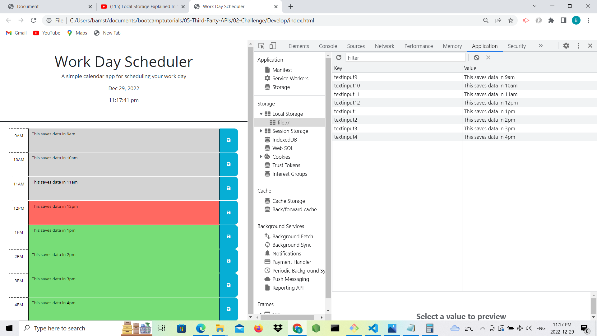

# 05 Third-Party APIs: Work Day Scheduler

Work Day Scheduler is a simple calendar applcation that displays schedule of daily activities at different time intervals. It shows date and time of the present day. When a user types in any data corresponding to the time of event, the application saves the data eventhough the application is refreshed or closed. 

## User Story

AS AN employee with a busy schedule
I WANT to add important events to a daily planner
SO THAT I can manage my time effectively

## Acceptance Criteria

GIVEN I am using a daily planner to create a schedule
WHEN I open the planner
THEN the current day is displayed at the top of the calendar
WHEN I scroll down
THEN I am presented with timeblocks for standard business hours
WHEN I view the timeblocks for that day
THEN each timeblock is color coded to indicate whether it is in the past, present, or future
WHEN I click into a timeblock
THEN I can enter an event
WHEN I click the save button for that timeblock
THEN the text for that event is saved in local storage
WHEN I refresh the page
THEN the saved events persist

## Below is the application picture

## Deployed Website 
URL: https://bamidele100.github.io/day-scheduler/

© 2022 Bamidele Talabi. Confidential and Proprietary. All Rights Reserved.
